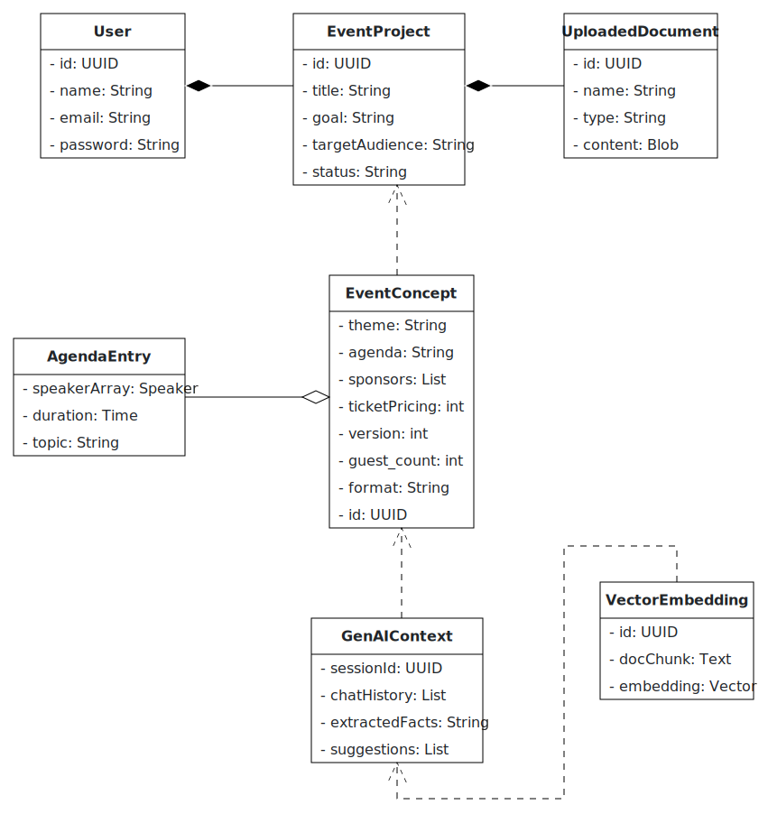

# AI Event Concepter

### What is the main functionality?

An interactive **co-creation assistant** that turns a vague event idea into a polished concept—fast. The planner drags in any relevant documents (past reports, industry papers, brand decks). The AI digests that material, asks follow-up questions until all gaps are filled, and delivers a full concept package: theme, format, agenda outline, speaker & sponsor suggestions, and ticket-price ideas, exportable as PDF and JSON. Because the AI does the heavy lifting—researching, matching, structuring—it **cuts days of manual work to minutes**, keeps all context in one place, and lets the planner iterate (“add a workshop,” “make it hybrid”) with a single prompt.

---

### Who are the intended users?

* **Event-agency planners** who prepare multiple client proposals.
* **Corporate planners** who must respect internal policies yet still wow stakeholders.

---

### How will you integrate GenAI meaningfully?

* **LangChain + Weaviate RAG** over *user-supplied* documents—no external scraping—so every suggestion is grounded in the customer’s own industry context.
* **Adaptive dialogue** powered by an LLM that follows nine standard conception steps, probes for missing details, remembers answers, and supports unlimited refinements.
* **Creative synthesis** prompt chains craft themes, agendas, and curated speaker/sponsor lists that reflect both uploaded content and the evolving conversation.
* **Continuous learning**—each new debrief or guideline embedded today improves tomorrow’s concepts automatically.

---

### Describe some scenarios how your app will function

**Co-create a fresh pitch** – The planner uploads last year’s debrief and a market white paper, then says “Target 300 attendees, hybrid preferred.” The AI summarises the docs, asks two clarifiers (duration, networking preference), and returns a one-day concept. The planner adds, “Include a hands-on workshop and make the theme more visionary.” The AI revises the agenda and title, then offers a ready-to-share PDF.

**Compliance-aware brainstorm** – A corporate planner supplies the company’s policy handbook and audience personas. The AI filters speaker suggestions to fit policy, proposes an online format for global reach, and crafts sponsor packages aligned with brand guidelines. When the planner asks, “Shorten it to a half-day and add a panel,” the AI updates the concept instantly.

**Learning loop** – After an event, the planner uploads debrief notes (“need stronger networking, ticket price felt high”). Next time, the AI automatically proposes an interactive networking segment and adjusted ticket tiers, then asks, “Anything else you’d like to refine?”—keeping the focus on creative improvement instead of administrative grind.

---

## 🏗 Architecture

The system follows a modular microservice architecture with clearly separated concerns across backend services, a modern web frontend, and scalable data infrastructure.

### 🔧 Component Overview

| Layer         | Technology              | Purpose                                           |
|---------------|--------------------------|---------------------------------------------------|
| API Gateway   | Spring Boot 3            | JWT authentication, routing, OpenAPI docs         |
| User Service  | Spring Boot 3            | User management, roles, preferences               |
| Concept Service| Spring Boot 3           | CRUD for concepts, PDF rendering                  |
| GenAI Service | Python 3.12 + LangChain  | Document ingestion, RAG pipeline, content creation|
| Web Client    | Angular 19               | Chat UI, adaptive flow, PDF viewer                |
| Relational DB | PostgreSQL               | Stores users, projects, concept metadata          |
| Vector DB     | Weaviate                 | Embeddings for trends & document chunks           |
| Object Store  | MinIO                    | Uploaded files and generated PDFs                 |
| Observability | Prometheus + Grafana     | Metrics and dashboards                            |
| Orchestration | Docker + Kubernetes      | Containerization and scalable deployment          |

---

## 📊 UML Diagrams

### 1. Analysis Object Model (UML Class Diagram)

This diagram shows the key objects and their relationships as identified during analysis.



---

### 2. Use Case Diagram

This diagram illustrates the main interactions between users and the system.


---

### 3. Top-Level Architecture (UML Component Diagram)

This diagram provides a high-level overview of the system’s components and their interactions.


---

## 📁 Repository Structure

The project is split into two main directories:

- `/client`: Angular 19 frontend
- `/server`: Spring Boot microservices (API Gateway, User Service, Concept Service)

---

## ⚙️ Prerequisites

Make sure the following tools are installed:

- [Node.js](https://nodejs.org/) (v22 or later)
- Java JDK 21+
- [Gradle](https://gradle.org/)
- Docker and Docker Compose
- Git

---

## 🚀 Setup Instructions

### Clone the Repository

```bash
git clone https://github.com/AET-DevOps25/team-git-push-force.git
cd team-git-push-force
```

### Client Setup

1. Navigate to the `client` directory:
   ```bash
   cd client
   ```
2. Install dependencies:
   ```bash
   npm install
   ```

### Server Setup

1. Navigate to the `server` directory:
   ```bash
   cd server
   ```
2. Build the project:
   ```bash
   ./gradlew build
   ```

## Running the Application

### Start the Client

```bash
cd client
npm run dev
```
The client will be available at [http://localhost:3000](http://localhost:3000).

### Start the Server

```bash
cd server
./gradlew bootRun
```
The server API will be available at [http://localhost:8080](http://localhost:8080).

